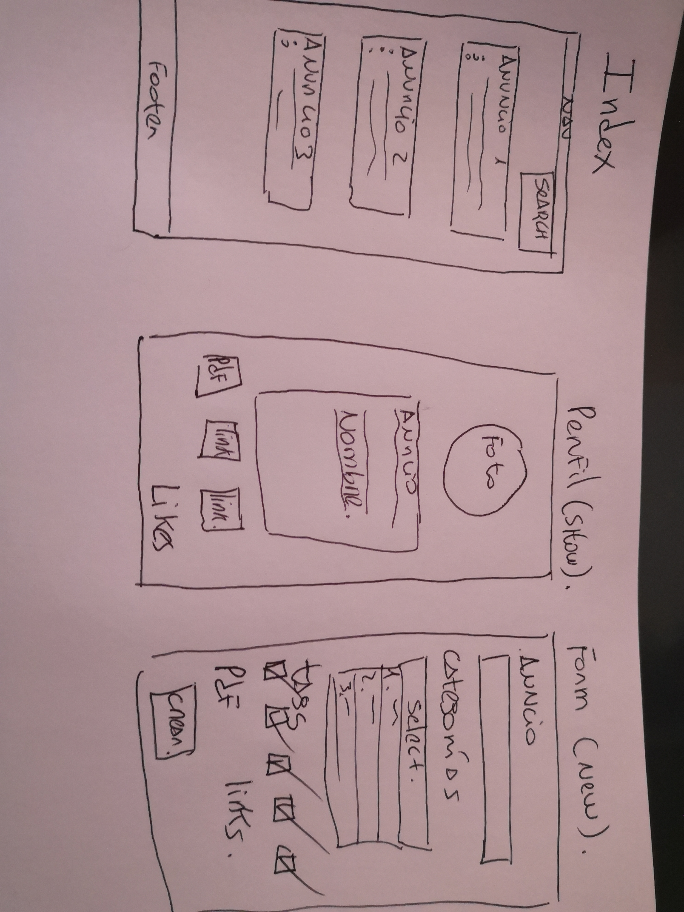

# UPCLASS

Aplicación permitirá ofrecer clases particulares, previo registro de datos.
Otros usuarios podrán ver todos los anuncios ingresados y su detalle. 
Usuarios podrán contactarse para concretar clases.

Generación de projecto en Rails con base de datos Postgresql.

Mockup

Diagrama conceptual:

Diagrama lógico

Link Trello https://trello.com/b/AF26cmYo/upclass

Aplicación generada con modelo CRUD.

